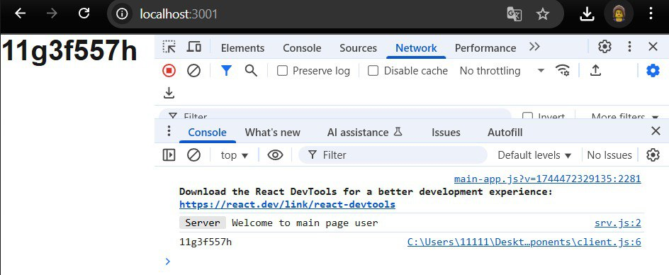
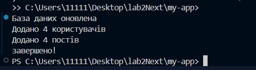
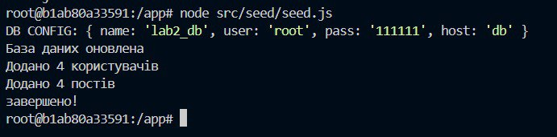
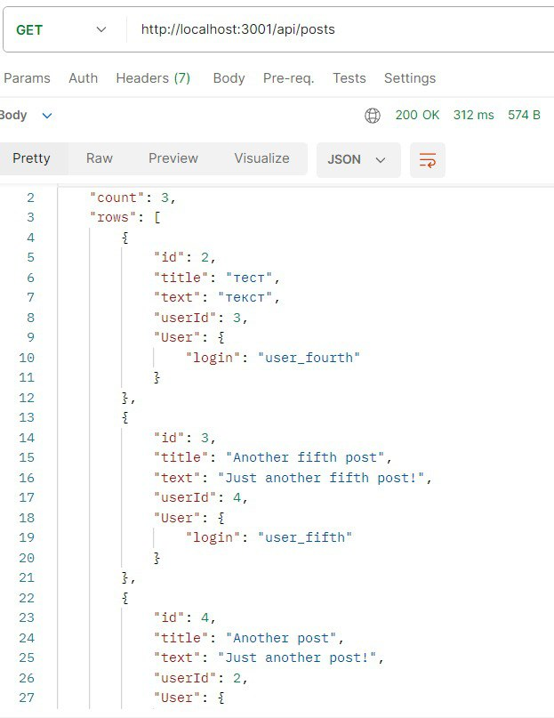

# Виведення значення змінних в консоль сервера консоль браузера і на сторінку

# Логи про успішне підключення до бази
даних

# використання seed з попереднього завдання

# скріншоти результатів запитів до API
